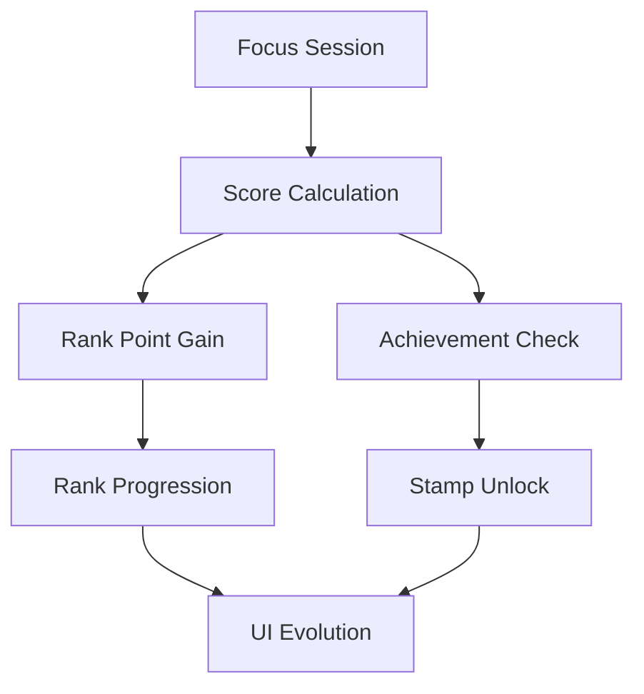
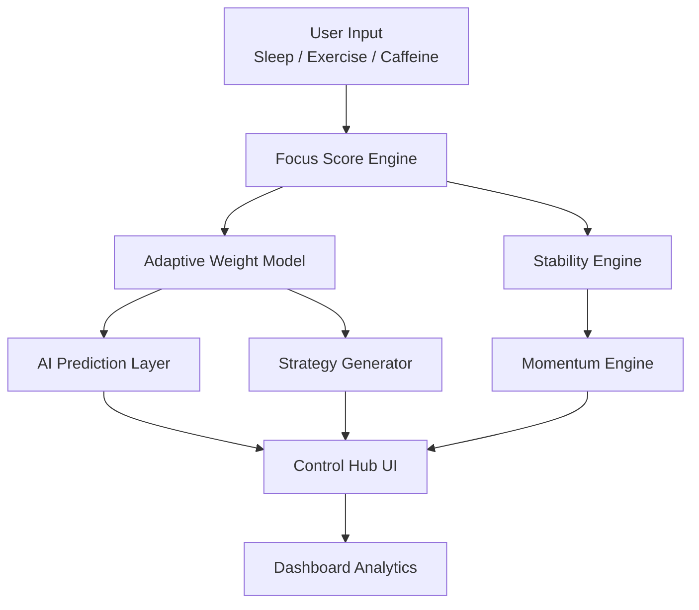
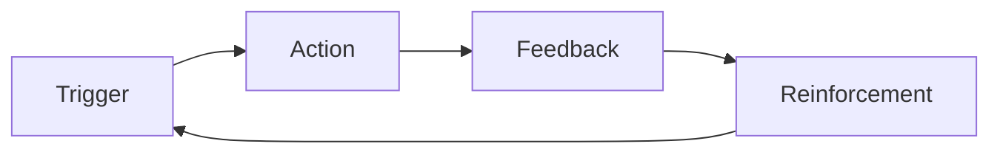

# 🧠 FOCUSLAB


> 집중을 기록하는 앱이 아니다.  
> 집중을 설계하는 시스템이다.

FOCUSLAB은 단순한 Pomodoro 타이머가 아닙니다.

이 프로젝트는 **행동 데이터를 기반으로 개인의 집중 패턴을 모델링하고, 통계적으로 분석하며, 예측 및 전략까지 연결하는 퍼포먼스 시스템**입니다.

기존 생산성 도구가 시간을 기록하는 데 집중했다면,  
FOCUSLAB은 **집중을 운영(Operate)하는 구조를 설계**합니다.

이는 단순한 앱이 아니라,  
**개인의 인지 퍼포먼스를 분석하고 최적화하기 위한 실험적 집중 OS**입니다.

---

## 🎯 Why FOCUSLAB?

대부분의 집중 앱은 시간을 재는 데에서 멈춥니다.  
기록은 하지만, 해석하지 않습니다.  
측정은 하지만, 전략을 제시하지 않습니다.

FOCUSLAB은 그 한계를 거부합니다.

FOCUSLAB은 질문합니다:

- 내 집중은 왜 올라가고 내려갈까?  
- 수면은 정말 영향을 줄까?  
- 운동은 점수에 얼마나 기여할까?  
- 카페인은 나한테 도움이 될까?

그리고 데이터로 답합니다.

---

## 🖥 System Overview

FOCUSLAB은 하나의 화면 안에서 다음 레이어를 통합합니다.

### 1️⃣ Real-Time Control Layer

- ⏱ Timer  
- 🧍 Body Input (수면(분), 운동 시간, 운동 거리, 카페인 섭취, 과목 선택)  
- 🎯 Focus Score  
- 🤖 AI Predicted Score  
- 📊 Stability (실시간 집중 안정도)  
- 📈 Prediction Gauge  
- 🔥 Session Metrics (Distractions, Session Minutes, Momentum)  
- 🧠 Chronotype Auto Classification  
- 📌 오늘의 집중 전략

---

#### 🔎 Control Hub Metrics Explained

**DISTRACTIONS**  
세션 중 발생한 집중 붕괴 이벤트 횟수입니다.  
(탭 전환, 사용자 이탈, 집중 흐름 저하 등)

이 지표는 "집중 점수"의 원인을 보여줍니다.

---

**SESSION (MIN)**  
현재 세션이 지속된 시간(분 단위)입니다.

집중은 단순 점수가 아니라,  
얼마나 오래 유지되었는지가 중요합니다.

---

**MOMENTUM**  
최근 집중 안정도 흐름의 상승/하락 추세입니다.

최근 5단위 평균과 이전 5단위 평균을 비교하여 계산됩니다.

- +값 → 집중 몰입 상승 중  
- -값 → 집중 붕괴 진행 중

이는 정적인 점수보다 더 중요한 "집중의 방향성" 지표입니다.

---

### 2️⃣ Analytics Dashboard Layer

하단 분석 영역은 단순 시각화가 아니라,  
집중 패턴을 시간·행동·과목 단위로 해석하기 위한 분석 도구입니다.

- 📈 **집중 타임라인**  
  세션별 집중 점수 흐름을 시간 순으로 표시합니다.  
  장기 추세(상승/하락)를 파악할 수 있습니다.

- 🕒 **일별 활동 타임라인 (24H View)**  
  하루 24시간 기준으로 언제 공부했고, 언제 쉬었고, 언제 운동했는지 시각화합니다.  
  과목별 색상 구분 + 휴식 구간 자동 표시 기능이 포함됩니다.

- 📊 **상관관계 분석 그래프**  
  수면(분), 운동 시간, 카페인 섭취와 집중 점수 간의 관계를 Pearson 상관계수로 계산합니다.

- 📅 **월별 집중 히트맵 (Streak 포함)**  
  날짜별 집중 기록 밀도를 표시하고 연속 집중 일수를 추적합니다.

- 🧬 **집중 리듬 분석 & 크로노타입 분류**  
  시간대별 평균 점수를 계산하여 아침형/저녁형/이중 피크형 등을 자동 분류합니다.

- 📑 **주간 리포트**  
  최근 7세션 평균 점수, 최고 점수, 평균 지속 시간 등을 요약합니다.

- 📦 **누적 통계**  
  총 세션 수, 과목별 총 공부 시간, 평균 집중 점수 등 장기 데이터를 제공합니다.

FOCUSLAB은 데이터를 단순히 보여주는 것이 아니라,  
시간 기반 집중 운영 구조를 분석합니다.

---

## 🎮 Gamification & Performance Layer

FOCUSLAB은 분석 시스템 위에 "퍼포먼스 게임화 레이어"를 추가합니다.

집중은 감정이 아니라 반복 가능한 시스템이어야 합니다.
이를 위해 다음 메커니즘이 작동합니다.

### 🏆 Rank Point (RP) System

집중 세션이 종료되면 Rank Point가 획득됩니다.

**RP 획득 공식**

- 기본: `집중 점수 × 0.5`
- 100점 달성 시 보너스 +20 RP
- 90점 이상 보너스 +10 RP
- 방해 0회 보너스 +10 RP

### ⬇ Rank Decay System

집중 점수가 50 미만일 경우:

- -30 RP 차감

이는 퍼포먼스를 유지하도록 설계된 긴장 장치입니다.

---

### 🥉 Rank Structure

| Rank | RP Threshold |
|------|-------------|
| Bronze 🥉 | 0 |
| Silver 🥈 | 500 |
| Gold 🥇 | 1500 |
| Platinum 🏆 | 3000 |
| Diamond 💎 | 6000 |

랭크는 누적 RP 기반으로 상승하며,
승급 시 애니메이션 효과가 발생합니다.

---

### 🎨 Rank-Based UI Evolution

랭크에 따라 인터페이스가 변화합니다.

- 타이머 색상 변화
- Diamond 달성 시 모노스페이스 폰트 적용
- Diamond 전용 Glow 효과
- Rank-Up 애니메이션
- RP Progress Gauge 표시

FOCUSLAB은 "시각적 피드백"을 통해 사용자의 동기 구조를 자극합니다.

---

### 🏅 Achievement Stamp System

FOCUSLAB은 희귀도 기반 업적 시스템을 포함합니다.

**Rarity Tier**

- Common
- Rare
- Legendary

#### 🎖 Full Achievement List

##### 🟢 Common

- 🎯 First Session — 첫 세션 기록
- 📘 10 Sessions — 10회 세션 달성
- 🔥 7-Day Streak — 7일 연속 집중
- 🏃 Runner — 운동 세션 20회 달성

##### 🔵 Rare

- 📚 30 Sessions — 30회 세션 달성
- 🧠 50 Sessions — 50회 세션 달성
- ⚡ 14-Day Streak — 14일 연속 집중
- 🌅 Morning Type Achieved — 아침형 집중 프로파일 달성
- 🌙 Night Type Achieved — 저녁형 집중 프로파일 달성
- ⚖️ Average 80+ — 평균 집중 점수 80 이상
- 📈 7-Session Peak — 최근 7세션 평균 85 이상

##### 🟣 Legendary

- 💎 100 Sessions — 100회 세션 달성
- 🏆 30-Day Streak — 30일 연속 집중
- 👑 60-Day Streak — 60일 연속 집중
- 💯 Perfect 100 — 단일 세션 100점 달성
- 🌌 Ultimate Focus Master — 평균 90 이상 + 50세션 이상

---

스탬프는 Hover 시 커스텀 툴팁이 표시되며,
해금 순간 Pop 애니메이션이 적용됩니다.

희귀도가 높을수록 시각적 효과가 강화됩니다.

이 시스템은 단순한 배지가 아니라,

> 행동 → 보상 → 반복 → 습관 형성

을 유도하기 위한 설계된 동기 구조입니다.

---

### 🎨 Rarity & Psychological Reinforcement

희귀도는 단순한 색상 구분이 아닙니다.

FOCUSLAB의 스탬프 시스템은 보상 강도를 시각적으로 차등화합니다.

- 🟢 **Common** → 반복 유도용 (빠른 성취 경험)
- 🔵 **Rare** → 구조적 성취 (습관 형성 단계)
- 🟣 **Legendary** → 정체성 강화 (장기 몰입 단계)

Legendary 스탬프는 강한 색상 대비와 Glow 효과를 통해

> "나는 이제 집중을 통제할 수 있다"

라는 정체성 피드백을 제공합니다.

이는 단순 배지가 아니라, 행동 지속 확률을 높이는 설계 요소입니다.

---

### 🔗 Rank & Stamp Relationship

랭크는 누적 퍼포먼스를 반영하고,
스탬프는 특정 행동 패턴을 강화합니다.



랭크는 "지속성"을 강화하고,
스탬프는 "행동 다양성"을 강화합니다.

이 둘은 경쟁 구조가 아니라 상호 보완 구조입니다.

---

FOCUSLAB은 분석 시스템 + 게임 메커니즘이 결합된
"집중 퍼포먼스 운영 엔진"입니다.

---

## 🏗 Architecture

FOCUSLAB은 단순 UI 중심 구조가 아니라, 데이터 흐름 중심으로 설계되었습니다.



### 🔁 Data Flow Summary

1. 사용자 입력이 Focus Score Engine으로 전달됩니다.  
2. 상관계수 기반 Adaptive Weight Model이 가중치를 조정합니다.  
3. AI Prediction Layer가 집중 점수를 예측합니다.  
4. Stability & Momentum Engine이 실시간 변화를 분석합니다.  
5. Strategy Generator가 행동 전략을 제안합니다.

이 모든 레이어는 Control Hub에서 통합되어 표시됩니다.

---

## 🧠 Data Intelligence

### 🔹 Pearson Correlation

FOCUSLAB은 다음 변수와 집중 점수 간의 상관관계를 계산합니다.

- 수면 (분 단위)  
- 운동 시간  
- 카페인 섭취 횟수

이를 통해:

- 어떤 요소가 집중 상승과 연결되는지  
- 어떤 요소가 집중 하락과 연결되는지

실제 데이터 기반으로 파악합니다.

---

### 🔹 Adaptive Weight Model

집중 점수 계산은 고정된 공식이 아닙니다.

상관계수 기반으로 가중치가 자동 조정됩니다.

```
sleep weight = 1 + rSleep
exercise weight = 1 + rExercise
caffeine weight = 1 - rCaffeine
```

사용자 데이터가 쌓일수록 모델은 개인화됩니다.

---

### 🔹 Momentum Engine

최근 집중 안정도 흐름을 분석하여:

- 상승 추세  
- 하락 추세

를 실시간으로 계산합니다.

이는 단순 점수보다 더 중요한 지표입니다.

---

## 🕒 Time-Based Intelligence

FOCUSLAB은 단순 점수 시스템을 넘어,
"언제 집중하는가"를 분석합니다.

### 🔹 Focus Rhythm Analysis

- 시간대별 평균 집중 점수 계산
- Peak Hour / Weak Hour 자동 탐지
- 평균 집중 지속 시간 계산

### 🔹 Chronotype Auto Classification

사용자의 세션 시작 시간 데이터를 기반으로:

- 🌅 아침형 집중 프로파일
- 🌙 저녁형 집중 프로파일
- 🔁 이중 피크형
- 🌓 중간형

을 자동으로 분류합니다.

이는 단순 성향 분류가 아니라,
전략 추천의 기반이 됩니다.

### 🔹 Daily Activity Timeline

- 과목별 색상 구분
- 운동 시간 별도 시각화
- 휴식 구간 자동 탐지
- 하루 24시간 기준 시각적 흐름 제공

FOCUSLAB은 하루를 하나의 퍼포먼스 로그로 기록합니다.

---

## 📌 오늘의 집중 전략

FOCUSLAB은 분석 결과를 단순히 보여주지 않습니다.

- 수면이 유의미하면 → 수면 전략 제안  
- 운동이 긍정 상관이면 → 운동 권장  
- 카페인이 음의 상관이면 → 섭취 감소 제안

데이터 → 행동으로 연결됩니다.

---

## 🧩 Design Philosophy

FOCUSLAB은 감성 생산성 앱이 아닙니다.

우리는 다음을 추구합니다:

- 감성보다 통제
- 장식보다 구조
- 직감보다 데이터
- 동기보다 시스템

UI는 사용자의 인지 자원을 아끼기 위해 설계되었습니다.
불필요한 감성적 연출 대신, 즉각적 피드백과 명확한 계층 구조를 제공합니다.

또한 FOCUSLAB은 "동기 설계"를 포함합니다.

- 랭크 시스템
- RP 게이지
- 승급 애니메이션
- 희귀도 기반 업적

이는 집중을 감정이 아닌, 반복 가능한 퍼포먼스 루프로 만들기 위한 구조적 장치입니다.

FOCUSLAB의 인터페이스는 단순한 화면이 아니라,

> 개인 인지 퍼포먼스를 운영하는 콘솔(Console)

입니다.

---

## 🔁 Behavior Loop Model

FOCUSLAB은 단순 추적 앱이 아니라,
행동 루프를 설계합니다.

### 📌 1. Trigger

- 타이머 시작
- 목표 설정

### 📌 2. Action

- 집중 세션 수행
- Body Input 기록

### 📌 3. Feedback

- Focus Score
- Stability
- AI Prediction
- RP Gain
- Stamp Unlock

### 📌 4. Reinforcement

- Rank 상승
- UI 진화
- 희귀도 기반 보상



이 루프는 감정 기반 동기부여가 아니라,

> 시스템 기반 자기 강화 구조

를 형성합니다.

FOCUSLAB의 목표는 단순히 시간을 재는 것이 아니라,

집중 행동을 반복 가능한 인지 루프로 전환하는 것입니다.

---

## 🚀 Future Extensions

- 선형 회귀 기반 예측 모델  
- 집중 붕괴 패턴 탐지  
- 전략 신뢰도(Confidence %) 표시  
- 개인 집중 최적 조건 자동 추천  
- PWA 확장

---

## 🎯 Product Perspective

FOCUSLAB은 다음과 같은 제품적 관점을 실험합니다:

- 데이터 기반 자기 최적화 시스템  
- 개인화 모델 자동 튜닝 구조  
- 행동 → 분석 → 전략의 완전한 루프 설계  
- 단일 화면 통합 퍼포먼스 대시보드

이 프로젝트는 단순 기능 구현이 아니라,  
"사용자의 인지 상태를 운영 가능한 시스템으로 전환하는 인터페이스 설계"를 목표로 합니다.

---

## 🛠 Tech Stack

- HTML  
- CSS  
- Vanilla JavaScript  
- LocalStorage 기반 데이터 관리  
- Canvas 기반 시각화

---

## 📍 Project Status

현재 버전은 개인 집중 분석 시스템의 MVP입니다.

FOCUSLAB은 계속 진화합니다.

---

## 🧠 Final Thought

시간을 재는 것은 누구나 할 수 있습니다.

하지만,

집중을 이해하고,  
집중을 분석하고,  
집중을 예측하고,  
집중을 전략화하는 것은 다릅니다.

FOCUSLAB은 단순한 타이머가 아닙니다.

**집중을 설계하는 시스템입니다.**
#FOCUSLAB
