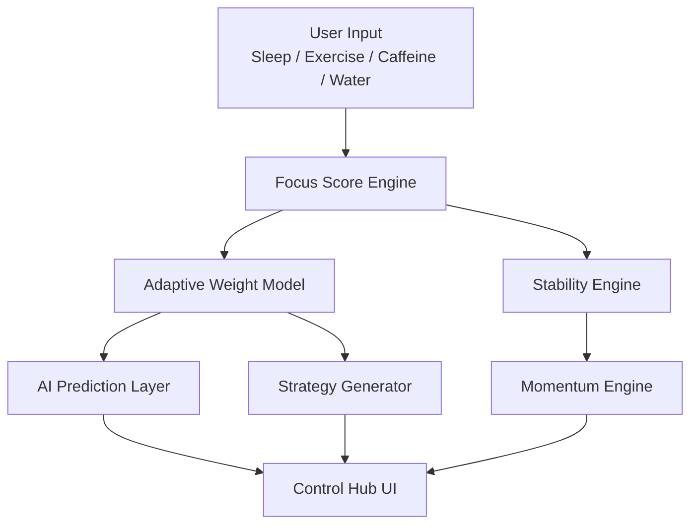

# 🧠 FOCUSLAB


> 집중을 기록하는 앱이 아니다.  
> 집중을 학습하는 인공지능 시스템이다.

FOCUSLAB은 행동 데이터를 기반으로 **개인의 집중 패턴을 학습하고 예측하는 브라우저 기반 Neural Performance System**입니다.

단순 타이머가 아니라,

**집중 → 학습 → 예측 → 전략 → 강화**

의 루프를 설계합니다.

---

# 🤖 Core: Neural Focus Model

FOCUSLAB의 핵심은 1 Hidden Layer Neural Network 입니다.

```
Input (Sleep, Exercise, Caffeine, Water)
        ↓
Hidden Layer (8 nodes, ReLU)
        ↓
Output (Predicted Focus Score)
```

### ⚙ Training Setup

- Adam Optimizer
- Train / Validation Split
- R² (결정계수) 기반 정확도
- MAE 기반 오차율
- Learning Curve 시각화
- Actual vs Predicted Scatter Plot
- Model Confidence 지표

모델은 analytics 페이지에서 학습되며,
index 페이지에서 실시간 예측에 사용됩니다.

즉,

> 학습과 실시간 예측이 통합된 구조입니다.

---


# 🚀 What Makes This Different?

일반 생산성 앱:

- 시간 기록
- 통계 표시

FOCUSLAB:

- 행동 데이터 학습
- Neural Network 기반 예측
- 모델 정확도 측정
- 신뢰도 표시
- 전략 자동 생성
- 게임화된 행동 강화 구조

이 프로젝트는 단순 앱이 아니라,

> 개인 인지 퍼포먼스를 모델링하는 실험적 AI 시스템

입니다.

---

# 🎯 Real-Time AI Control Hub

## Control Layer

- ⏱ Focus Timer
- 🎯 Focus Score Engine
- 🤖 AI Predicted Score
- 📊 Stability Engine
- 🔥 Distractions Tracker
- 📈 Momentum Engine
- 🧠 Chronotype Classification
- 📌 AI 기반 오늘의 집중 전략

모든 상태는 LocalStorage 기반으로 유지되며,
세션 단위로 완전 분리됩니다.

---

# 📊 Data Intelligence Layer

### Pearson Correlation Engine

- 수면 vs 점수
- 운동 vs 점수
- 카페인 vs 점수
- 물 섭취 vs 점수

행동 데이터는 단순 통계가 아니라
전략 생성과 가중치 조정에 직접 반영됩니다.

### Adaptive Weight Model

집중 점수는 고정 공식이 아닙니다.
상관계수와 학습 결과에 따라 가중치가 조정됩니다.

FOCUSLAB은 정적인 점수 시스템이 아니라,
**사용자 데이터를 학습하는 적응형 AI 구조**입니다.

---

# 🏆 Performance Reinforcement Layer

- Rank Point (RP) 시스템
- Rank Progression (Bronze → Diamond)
- Achievement Stamp (Common / Rare / Legendary)
- Rank 기반 UI 진화

행동 → 보상 → 반복 → 습관 형성

을 데이터 기반으로 설계합니다.


---

# 🤖 Core: Neural Focus Engine

FOCUSLAB의 핵심은 1 Hidden Layer Neural Network 입니다.

## 📐 Model Structure

입력 벡터:

```
x = [sleep, exercise, caffeine, water]
```

은닉층 계산:

```
h = ReLU(W₁x + b₁)
```

출력층 계산:

```
ŷ = W₂h + b₂
```

즉,

```
ŷ = W₂ · ReLU(W₁x + b₁) + b₂
```

---

## 📉 Loss Function

Mean Squared Error (MSE):

```
L = (1/n) Σ (y - ŷ)²
```

Mean Absolute Error (MAE):

```
MAE = (1/n) Σ |y - ŷ|
```

결정계수 R²:

```
R² = 1 - (Σ (y - ŷ)² / Σ (y - ȳ)²)
```

---

## ⚙ Optimizer: Adam

Adam 업데이트 식:

```
mₜ = β₁mₜ₋₁ + (1-β₁)gₜ
vₜ = β₂vₜ₋₁ + (1-β₂)gₜ²

m̂ₜ = mₜ / (1-β₁ᵗ)
v̂ₜ = vₜ / (1-β₂ᵗ)

θₜ = θₜ₋₁ - α · m̂ₜ / (√v̂ₜ + ε)
```

- Adaptive Learning Rate
- Bias Correction
- 안정적인 수렴 특성

---

# 📊 Data Intelligence Layer

## Pearson Correlation

상관계수 계산식:

```
r = Σ((x - x̄)(y - ȳ)) / √(Σ(x - x̄)² Σ(y - ȳ)²)
```

- 수면 vs 점수
- 운동 vs 점수
- 카페인 vs 점수
- 물 섭취 vs 점수

상관계수는 전략 생성과 가중치 조정에 반영됩니다.

---

# 🏆 Performance Reinforcement Layer

- Rank Point (RP) 시스템
- Rank Progression (Bronze → Diamond)
- Achievement Stamp (Common / Rare / Legendary)

행동 → 보상 → 반복 → 습관 형성

의 구조를 데이터 기반으로 설계합니다.

---

FOCUSLAB은 UI 중심 구조가 아닙니다.

**AI 모델을 중심으로 데이터가 흐르는 구조**입니다.

집중 점수 → 학습 → 예측 → 전략 → 피드백이
하나의 파이프라인으로 연결됩니다.

# 🏗 Architecture



이 구조는 단순 기능 나열이 아니라,

- 입력 데이터가 어떻게 모델로 들어가고
- 예측 결과가 어떻게 전략으로 변환되며
- 그 전략이 다시 행동을 유도하는지

를 명확하게 보여줍니다.

FOCUSLAB의 핵심은 기능이 아니라 **AI 중심 데이터 흐름 설계**입니다.

---

# 🚀 Why This Is Different

일반 생산성 앱은 시간을 기록합니다.

FOCUSLAB은 행동 데이터를 학습합니다.

- Neural Network 기반 예측
- 실시간 모델 활용
- 모델 정확도 및 신뢰도 측정
- 전략 자동 생성
- 강화 루프 설계

이 프로젝트는 단순 앱이 아니라,

> 개인 인지 퍼포먼스를 모델링하는 실험적 AI 시스템

입니다.

---

# 🧠 Final Statement

시간을 재는 것은 쉽습니다.

집중을 이해하는 것은 어렵습니다.

집중을 학습하는 것은 설계입니다.

FOCUSLAB은 그 설계를 실험합니다.

**Design Your Focus.**
